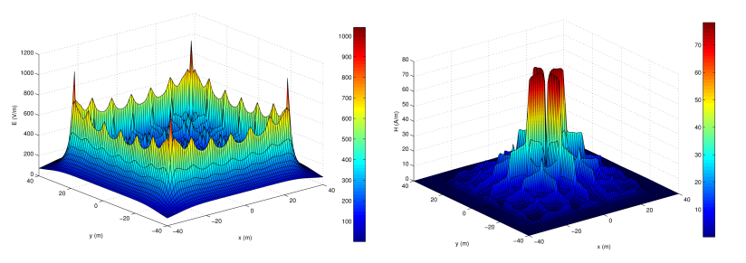

# EarthGrid
Analysis of complex grounding grids buried in horizontally stratified multilayer soil.

Steady-state and transient analysis, in the frequency domain, of complex 3D grounding grids buried in horizontally stratified multilayer soil. (1) Computing low-frequency grounding resistance, as well as scalar potential distribution and electromagnetic fields distribution in horizontally stratified multilayer medium, which consists of the air and multilayer soil. (2) Computing the high-frequency and time-domain (by means of the fast Fourier transform) transient impedance, scalar potential distribution and electromagnetic fields distribution in horizontally stratified multilayer medium. There is no limit on the number of soil layers nor their parameters. Grounding grid is an arbitrary 3D structure of interconnected conductors (thin-wire approximation), which can be buried and connected with metallic superstructures above the earth's surface. Electromagnetic fields can be computed on the earth's surface, in the air, or below the ground.

**References**
P. Sarajcev, S. Vujevic and D. Lovric, Computing the electromagnetic field of the system of arbitrarily positioned conductors in horizontally stratified multilayer medium, INTERNATIONAL JOURNAL OF NUMERICAL MODELLING: ELECTRONIC NETWORKS, DEVICES AND FIELDS, 2014.
